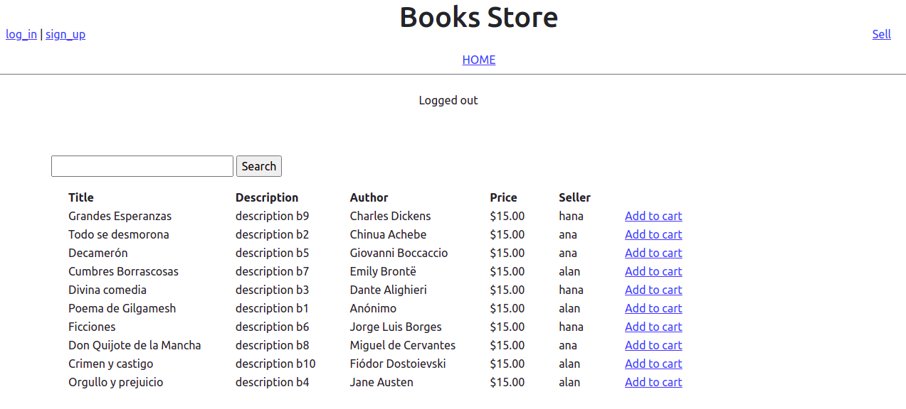

<h1 align="center">Book Store</h1>

<p align="center">
  <strong>Made by Alan Soto</strong>
  <br>
Online book store where buyers can search and buy from a collection of books offered by registered sellers. Registered users can add and remove books from the shopping cart, check their available credit, and shop. Users using the application can see any changes made by others to the main list of books in real time.
</p>



<hr>

<p align="center">
  <a href="https://github.com/AlanSoto31/telos-book-store/issues">
    
  </a>
   ‎ ‎ ‎ ‎
  <a href="https://github.com/AlanSoto31/telos-book-store/issues">
    
  </a>
</p>

<hr>


## Table of Contents

- [Live Demo](#Live-Demo)
- [Built With](#built-With)
- [🖥️ Getting Started](#getting-Started)
  - [Setup](#setup)
  - [Testing](#testing)
- [👥 Author](#author)
- [🤝 Contributing](#contributing)
- [⭐ Show your support](#show-your-support)


## Live Demo

[Live version](https://telos-book-store.herokuapp.com/)


## Built With

- Ruby on Rails 6
- Bootstrap
- Rspec
- VS Code
- Heroku


## Getting Started

Get a local copy, type on console...

````
 $ cd <'the location yo want to save the project'>
 $ git clone https://github.com/AlanSoto31/telos-book-store.git
 ````


### Setup

1. Go inside the project folder: `cd telos-book-store`.
2. Install dependencies: `bundle install`.
3. Migrate the database: `rails db:migrate`.
4. Fill the tables: `rails db:seed`.
5. Start the application: `rails s`.
6. Open `http://localhost:3000/` in the browser of your preference.
7. Stop the application: `ctrl + c`

## Testing

1. Go inside the project folder: `cd telos-book-store`.
2. Run in your console `rspec`


## Author

👤 **Alan Soto**

- GitHub: [@AlanSoto31](https://github.com/AlanSoto31)
- Twitter: [@Alan_Soto31](https://twitter.com/Alan_Soto31)
- LinkedIn: [Alan Soto](https://www.linkedin.com/in/alan-soto-valle/)


## Contributing

Contributions, issues and feature requests are welcome!

Feel free to check the [issues page](https://github.com/AlanSoto31/telos-book-store/issues).


## Show your support

Give a ⭐️ if you like this project!


## 📝 License

This project is [MIT](https://opensource.org/licenses/MIT) licensed.
